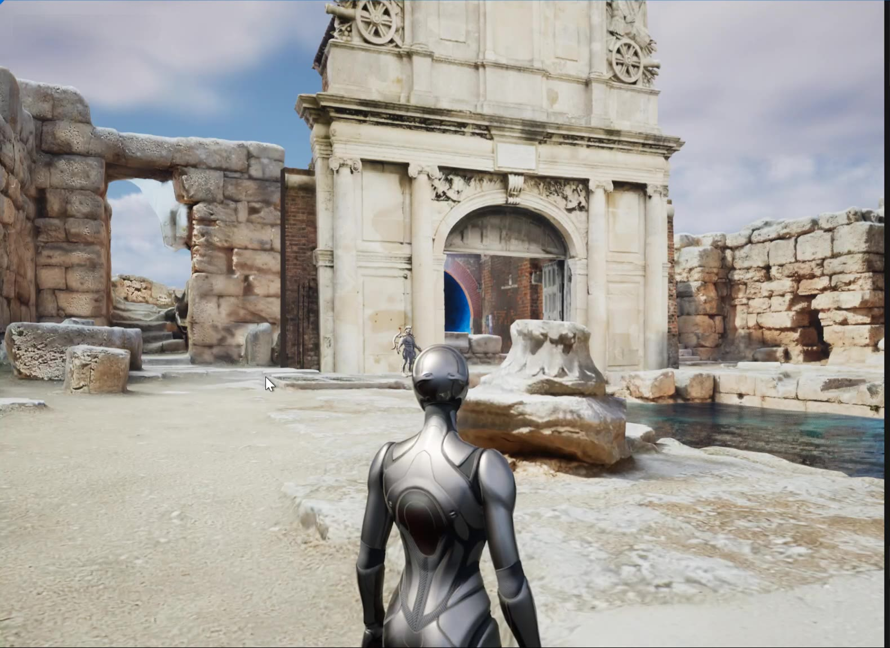
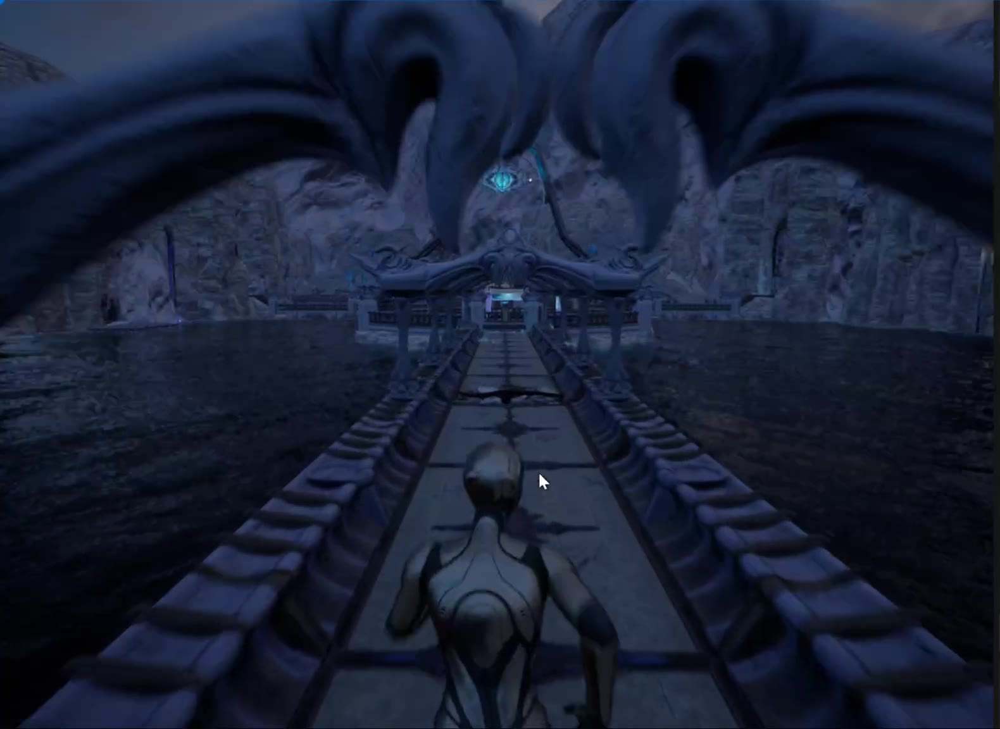
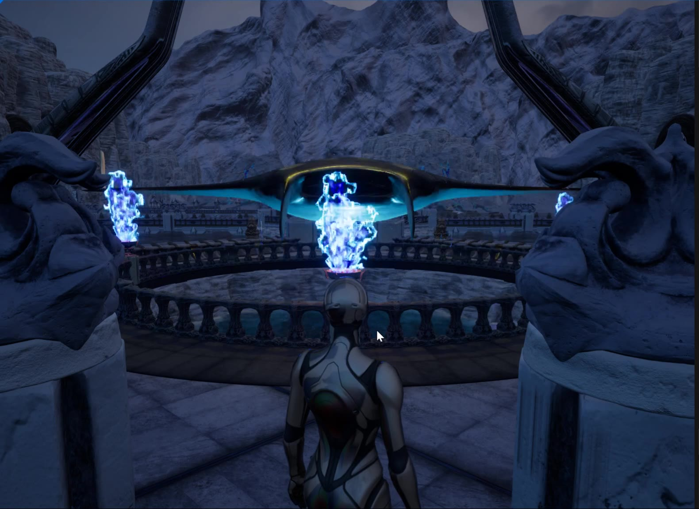
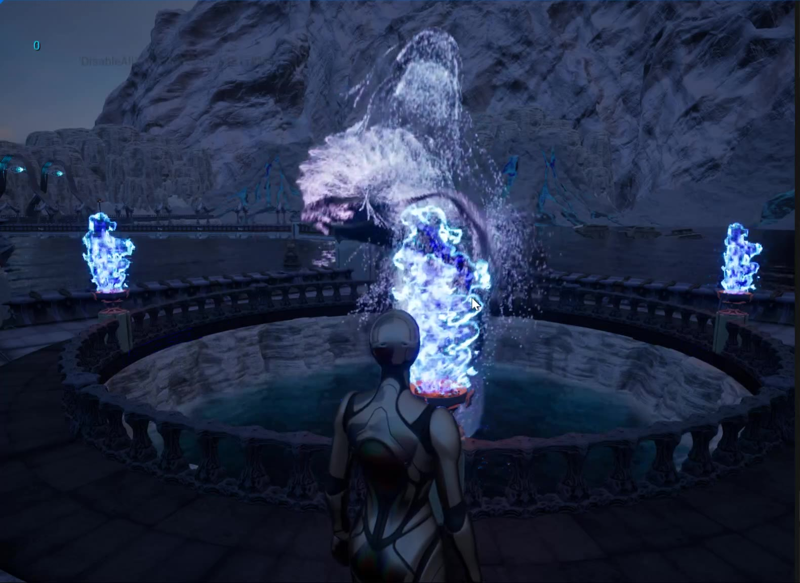

# BridgeHell — UE5 沉浸式关卡 Demo

> Unreal Engine 5.4 · Blueprint · Blender · Niagara

## 项目简介

一段约 3 分钟的第三人称叙事关卡 Demo，独立完成全部设计与实现。项目验证一个设计假设：**去掉全部文字与 UI 提示，仅依靠光线（火盆）、环境音与触碰反馈，能否引导玩家完成路径并递进情绪**。

关卡以「鲸」为情绪核心，按「平静 → 异变 → 冲击」三段式组织节奏：玩家从日光遗迹出发，经由 Loading 转场进入冰雪夜景，沿水上的长桥前行——沿途的蓝色火焰火盆是唯一的路径指引；抵达中央祭坛、点燃火焰后，巨大的水鲸自圆形水池中跃出，完成整段的情绪释放。

## 关卡结构

| 段落 | 场景 | 设计意图 |
|---|---|---|
| 一 · 平静 | 日光遗迹 | 空间教学段，用建筑体量与开口建立探索动线 |
| 二 · 异变 | 冰雪夜 · 长桥 | 光线引导段：火盆作为唯一视觉锚点串联主路径，水面倒影强化空间纵深 |
| 三 · 冲击 | 中央祭坛 | 情绪高潮：触碰点燃蓝色火焰（Niagara 粒子），触发水鲸跃出水面 |

## 截图

**开场 · 日光遗迹**

**光线引导 · 冰雪长桥**

**中央祭坛 · 蓝色火焰火盆**

**情绪高潮 · 水鲸跃出水面（Niagara 粒子特效）**

## 我的职责

- **关卡设计**：三段式节奏结构、无 UI 光线路径引导、触碰交互机制与情绪递进设计
- **资产制作**：核心模型与场景资产 Blender 自建，其余素材来自 UE 商城（因资产许可与体积原因未包含在本仓库）
- **实现**：UE5 蓝图（角色控制、交互逻辑、UI）、Niagara 粒子特效（火焰、水鲸）、场景搭建与渲染

## 运行说明

本仓库仅包含工程配置（`BridgeHell.uproject` / `Config`），完整资产因体积与许可原因未入库。使用 UE 5.4 打开。

## 联系

王家宜 · 1036645122@qq.com
